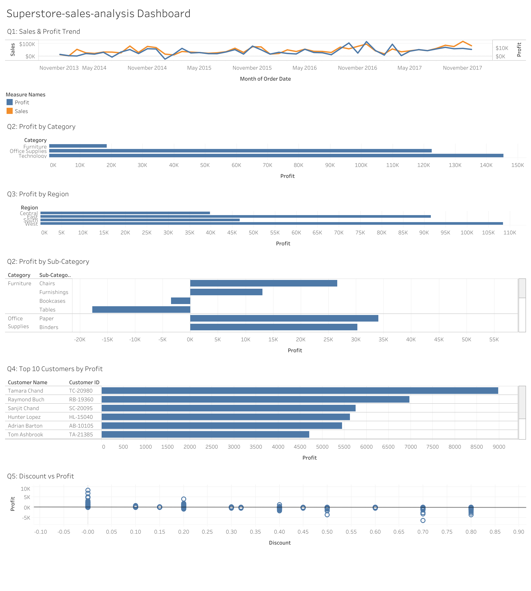

# E-Commerce Sales Analysis

## Project Overview

This project analyzes the Superstore dataset to evaluate sales performance, profitability, customer value, and regional performance. The objective is to identify key business insights and provide recommendations that support data-driven decision-making.

## Business Questions

1. How have sales and profit changed over time?
2. Which products generated the highest profit?
3. Which regions contributed the most sales and profit?
4. Who are the most valuable customers?
5. Does discount help increase profit?

## Dataset

**Source:** Superstore Dataset (Kaggle)

The dataset contains transactional information including:

- Orders
- Customers
- Products
- Sales
- Profit
- Discounts
- Regions

### Dataset Summary

| Metric | Value |
|----------|----------|
| Rows | 9,994 |
| Columns | 21 |
| Time Period | 2014 - 2017 |
| Regions | 4 |
| Customers | 793 |
| Categories | 3 |
| Total Sales | $2,297,200.86 |
| Total Profit | $286,397.02 |
| Profit Margin | 12.47% |

## Data Cleaning

The dataset was reviewed to ensure data quality and reliability.

### Checks Performed

- Missing values
- Duplicate records
- Data types
- Data consistency
- Extra spaces
- Date and number formats
- Business logic validation

### Business Rules Reviewed

- Ship Date should occur on or after Order Date
- Discount values should remain between 0 and 1
- Sales should not contain negative values
- Quantity should be a natural number

## Tools Used

- Microsoft Excel
- Tableau
- GitHub

## Dashboard

The dashboard provides an overview of:

- Sales and Profit Trends
- Regional Performance
- Product Performance
- Customer Performance
- Discount Impact Analysis

### Dashboard Preview



## Key Findings

- Sales and profit showed an overall growth trend throughout the analyzed period.
- Regional performance varied significantly across locations.
- A small number of products generated a large share of total profit.
- High-value customers contributed disproportionately to overall profitability.
- Higher discount levels tended to reduce profitability.

## Recommendations

- Focus on expanding high-performing products and categories.
- Strengthen operations in profitable regions.
- Develop retention strategies for valuable customers.
- Review discount policies to improve profit margins.

## Project Structure

```text
ecom-sales-analysis
├── dashboard
│   ├── dashboard.png
│   └── dashboard.twb
├── sample data
│   └── superstore.xlsx
├── report
│   └── report.docx
└── README.md
```

## Author

**Dac Tai Nguyen** | Data Analytics & Business Intelligence
